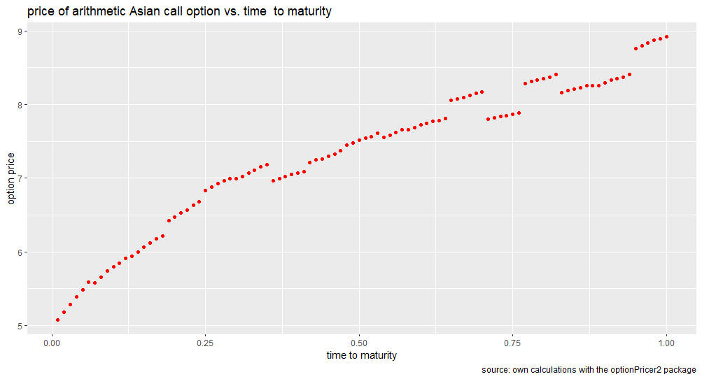
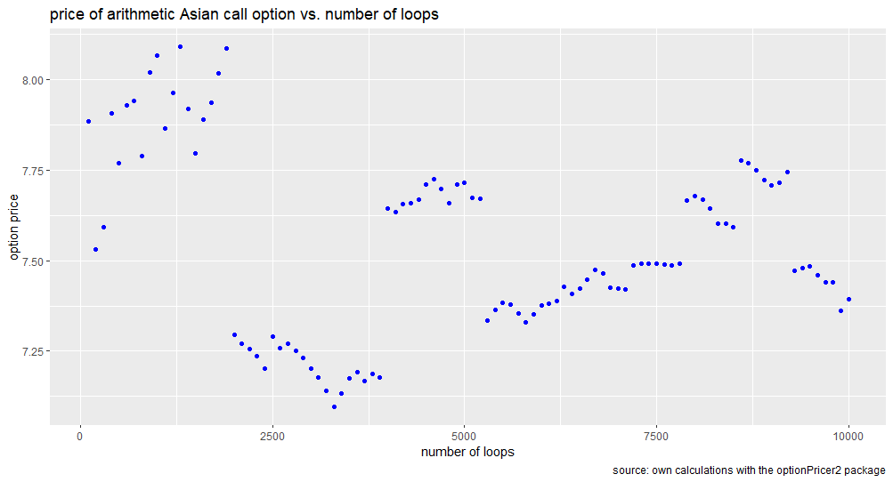
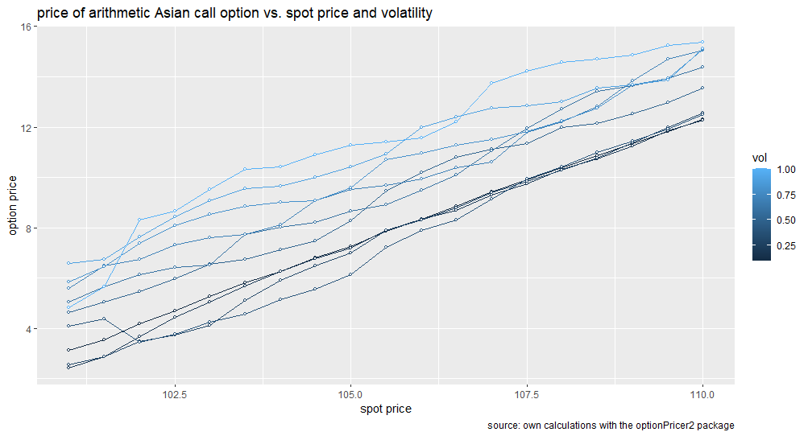
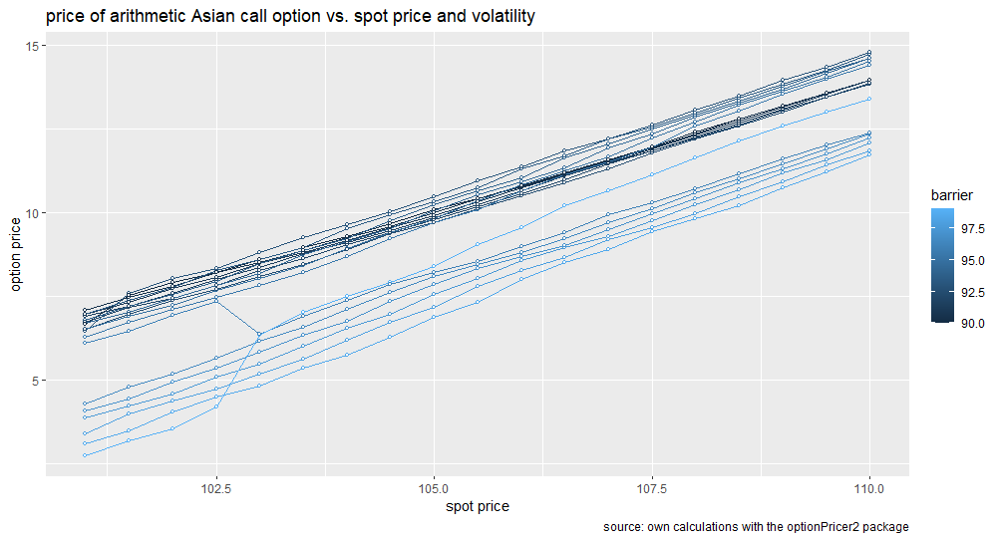

# EuropeanOptionPricer
R package for calculating European style down-and-out call option with a barrier active between the moment of pricing and the option expiry.

## How to Import This Package

  ### Import Package from Github
  
    ```{ruby}
        library(devtools)
        install_github("AlparslanErol/EuropeanOptionPricer")
        library(EuropeanOptionPricer)
    ```

  ### Import Package from binaries (no need to rebuild)
  After you build binary folder of this package with name ``EuropeanOptionPricer_1.0.zip``, 
  you can run the code chunk below to import EuropeanOptionPricer package from
  binary folder.
  
    ```{ruby}
      install.packages("./EuropeanOptionPricer_1.0.zip",
                       type = "binaries",
                       repos = NULL,
                       dependenciew=TRUE)
      library(EuropeanOptionPricer)
    ```  
    
## Call the function from the package
To call the ``europeanCallPriceWithBarrier`` method from ``EuropenOption`` class,
just run the code chunk below, feel free to change argument of method.
  
    ```{ruby}
      EuropeanOptionPricer::europeanCallPriceWithBarrier(126, 100, 105, 99, 0.22, 0.05, 0.5, 10000)
    ``` 
    
Here is the arguments of ``europeanCallPriceWithBarrier`` method from ``EuropenOption`` class in order:

- ``int nInt``: Number of interval till the expiry time
- ``double strike``: Strike price
- ``double spot``: Spot price
- ``double barrier``: Barrier price
- ``double vol``: Annualized volatility rate
- ``double r``: Annualized risk-free rate
- ``double expiry``: Time to maturity
- ``double nReps``: Number of repeat for random sample in Monte Carlo method.
  * Using higher number of ``nReps`` allows you to decrease std of output because of the __Central Limit Theory__.
  

## Plot1: Option Price vs Expiry Plot


## Plot2: Option Price vs Number of Loops


## Plot3: Option Price vs Spot Price coloured with Volatality


## Plot4: Option Price vs Spot Price coloured with Volatality
