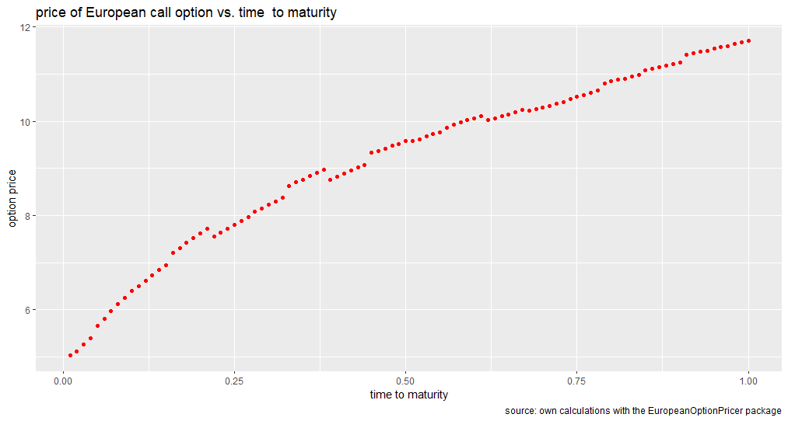
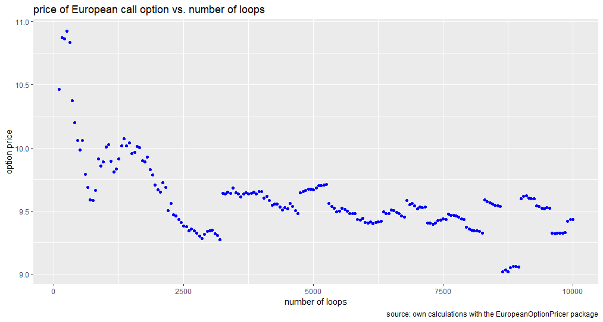
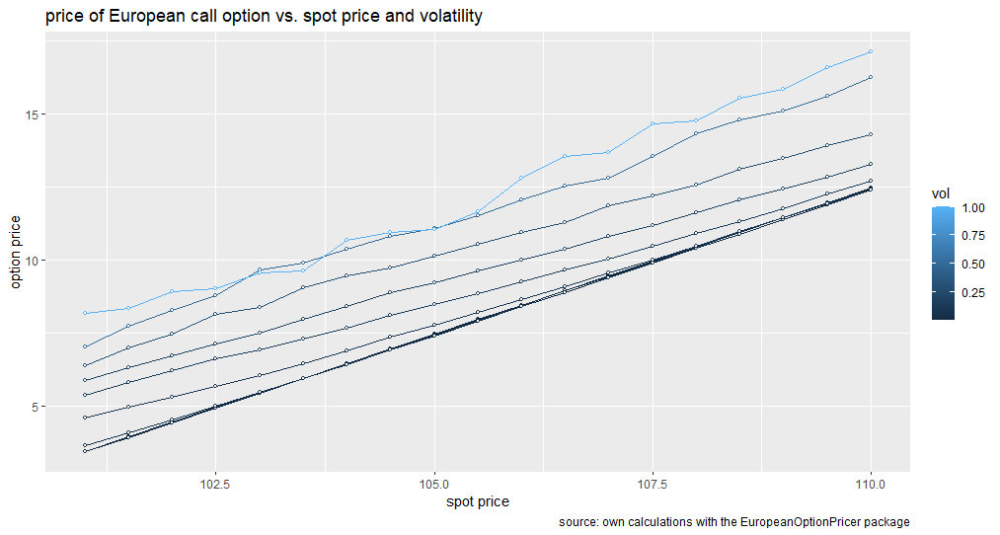
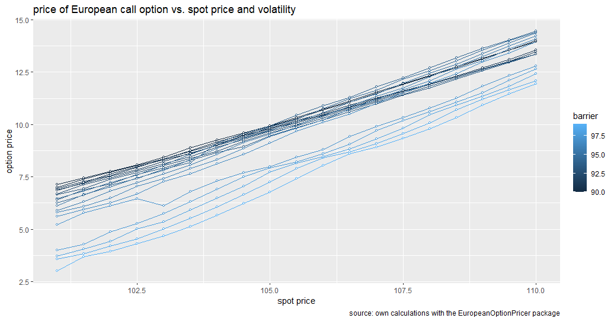
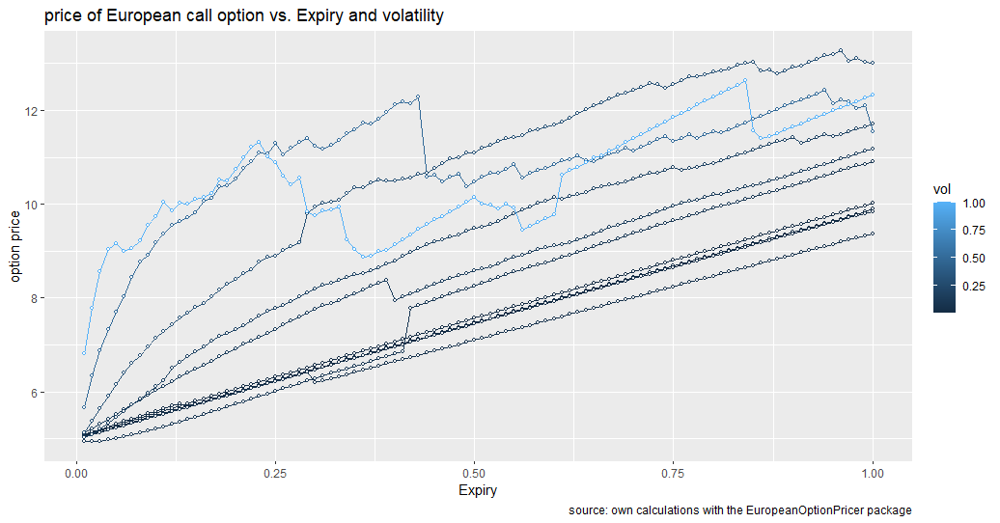

# EuropeanOptionPricer
R package for calculating ``European style down-and-out call option with a barrier active`` between the moment of pricing and the option expiry.

## Problem
Let's begin with a European style down-and-out call option. At expiry it pays the usual call
payoff max(S − E, 0), provided that S has not fallen to B− during the life of the option.
If S ever reaches B− then the option becomes worthless. Obviously the down-and-out call
should cost less than the corresponding call, because of the additional risk of knock-out,
with premature loss of the premium.

[Reference HERE](https://people.maths.ox.ac.uk/howison/barriers.pdf)

Specifically you are going to find:
1. The theoretical price of this option,
2. Relation between the ``theoretical price of the option`` and two factors (simultaneously):
   * ``volatility`` of the underlying instrument returns, and
   * ``time to maturity`` of the option.

These following values are assumed to illustrate the performance of solution:
- price of the underyling at the moment of option pricing: ``S0 = 105``,
- strike price ``K = 100``,
- annualized volatility rate ``σ = 0.22``,
- annualized risk-free rate ``r = 0.05``,
- time to maturity ``t = 0.5``

## Objective
This project is submitted as an assignment for ``Applied Finance`` class in Data Science and Business Anlaytics 
Master's degree program at University of Warsaw.

> In accordance with the Honor Code, I certify that my answers here are my own work, and I
did not make my solutions available to anyone else.

The aim of this project is creating and ``Rcpp`` package which provides a function the __Monte Carlo__ approximation 
of the option theoretical price to solve the problem described above. Therefore, this ``Rcpp`` package was 
created and located into Github to install it from any R script easily.

## Solution
0. CONSTRAINTS:
   1. the price has to decrease to reach the barrier
   2. canceled when asset price reaches the barrier
   3. Φt = max(ST − X, 0) if min(St) ≥ L
1. N times randomly generated paths created to simulate the real life ``Random Walk`` motion on the prices.
2. Based on this price paths, max(S - X, 0) function is calculated as a rolling sum value if:
   1. minimum spot price >= Barrier level
3. Final ``European style down-and-out call option with a barrier active`` value is calculated as __output__. 


## How to Import This Package

  ### Import Package from Github
  
```{r}
library(devtools)
install_github("AlparslanErol/EuropeanOptionPricer")
library(EuropeanOptionPricer)
```

  ### Import Package from binaries (no need to rebuild)
  After you build binary folder of this package with name ``EuropeanOptionPricer_1.0.zip``, 
  you can run the code chunk below to import EuropeanOptionPricer package from
  binary folder.
  
```{r}
install.packages("./EuropeanOptionPricer_1.0.zip",
                 type = "binaries",
                 repos = NULL,
                 dependenciew=TRUE)
library(EuropeanOptionPricer)
```  
    
## Call the function from the package
To call the ``europeanCallPriceWithBarrier`` method from ``EuropenOption`` class,
just run the code chunk below, feel free to change argument of method.
  
```{r}
EuropeanOptionPricer::europeanCallPriceWithBarrier(126, 100, 105, 99, 0.22, 0.05, 0.5, 10000)
``` 
    
Here is the arguments of ``europeanCallPriceWithBarrier`` method from ``EuropenOption`` class in order:

- ``int nInt``: Number of interval till the expiry time
- ``double strike``: Strike price
- ``double spot``: Spot price
- ``double barrier``: Barrier price
- ``double vol``: Annualized volatility rate
- ``double r``: Annualized risk-free rate
- ``double expiry``: Time to maturity
- ``double nReps``: Number of repeat for random sample in Monte Carlo method.
  * Using higher number of ``nReps`` allows you to decrease std of output because of the __Central Limit Theory__.
  
## Results
### 1: Option Price vs Expiry Plot
In this part, option price and time to maturity will be observed. Please find the final evaluation of relation between
time to maturity and option price under the plot below.
```{r}
# 1. build an R wrapping function: option price vs. time to maturity ===========
getEuropeanCallPriceWithExpiry <- function (expiry) {
  return(
    EuropeanOptionPricer::europeanCallPriceWithBarrier(126, 100, 105, 95, 0.22, 0.05, expiry, 10000)
  )
}

# call the wrapping function 
getEuropeanCallPriceWithExpiry(0.5)

# arguments values of values of function 
expiry <- seq(0.01, 1, by = 0.01)
prices <- sapply(expiry, getEuropeanCallPriceWithExpiry)

# visualization: options price vs. expiry 
tibble(expiry, prices) %>%
  ggplot(aes(expiry, prices)) +
  geom_point(col = "red") +
  labs(
    x     = "time to maturity",
    y     = "option price",
    title = "price of European call option vs. time  to maturity",
    caption = "source: own calculations with the EuropeanOptionPricer package")
```


In this plot, it can easily observe that when the time to maturity value increased, option price is also increasing. 

### 2: Option Price vs Number of Loops
In this part, option price and Loops will be observed. Please find the final evaluation of relation between
Loops and option price under the plot below.
```{r}
# 2. build an R wrapping function: option price vs. number of loops ============
getEuropeanCallPriceWithLoops <- function (loops) {
  return(
    EuropeanOptionPricer::europeanCallPriceWithBarrier(126, 100, 105, 95, 0.22, 0.05, 0.5, loops)
  )
}

# call the wrapping function 
getEuropeanCallPriceWithLoops(500)

# arguments values of values of function 
loops  <- seq(100, 10000, by = 50)
prices <- sapply(loops, getEuropeanCallPriceWithLoops)

# visualization: options price vs. numbers of loops 
tibble(loops, prices) %>%
  ggplot(aes(loops, prices)) +
  geom_point(col = "blue") +
  labs(
    x     = "number of loops",
    y     = "option price",
    title = "price of European call option vs. number of loops",
    caption = "source: own calculations with the EuropeanOptionPricer package")
# note the same seed within one second!
```


In this plot, it can easily observe that lower ``number of loops`` distribution has bigger standard deviation on the values,
however when you increase the number of loops, the output distribution will be more precise and has less standard deviation.
Since we are working on some probability calculations, this can be easily explained as follows:

* Using higher number of ``nReps`` allows you to decrease std of output because of the __Central Limit Theory__.

### 3: Option Price vs Spot Price coloured with Volatality
In this part, you are going to observe relation between the ``theoretical price of the option`` and two factors (simultaneously):
1. spot price (x-axis on the plot)
2. Volatility (color input on the plot)
```{r}
# 3. build an R wrapping function: option price vs. spot and volatility =======
getEuropeanCallPriceWithSpotAndVol <- function (spot, vol) {
  return(
    EuropeanOptionPricer::europeanCallPriceWithBarrier(126, 100, spot, 95, vol, 0.05, 0.5, 500))
}

# call function once
getEuropeanCallPriceWithSpotAndVol(105, 0.22)

# sequences of argument values
spot <- seq(110, 101, by = -0.5)
vol  <- c(0.001, 0.01, 0.02, 0.05, 0.1, 0.15, 0.2, 0.3, 0.5, 1)

grid      <- expand.grid(spot = spot, vol = vol)
prices    <- mapply(getEuropeanCallPriceWithSpotAndVol, 
                    spot = grid$spot, vol = grid$vol)
result.df <- data.frame(grid, prices)
head(result.df)

# visualization: options price vs. spot price and volatility
grid %>% 
  as_tibble() %>%
  bind_cols(price = prices) %>%
  ggplot(aes(x = spot, y = price, group = vol, colour = vol)) +
  geom_line() +
  geom_point(size = 1, shape = 21, fill = "white") +
  labs(
    x     = "spot price",
    y     = "option price",
    title = "price of European call option vs. spot price and volatility",
    caption = "source: own calculations with the EuropeanOptionPricer package")
```


This plot illustrates couple of insights as follows:
- Higher spot price increase the option price
- Regardless the value of spot price, higher volatility directly increase the option price

### 4: Option Price vs Spot Price coloured with barrier
In this part, you are going to observe relation between the ``theoretical price of the option`` and two factors (simultaneously):
1. spot price (x-axis on the plot)
2. barrier (color input on the plot)
```{r}
# 4. build an R wrapping function: option price vs. spot and barrier =======
getEuropeanCallPriceWithSpotAndBar <- function (spot, barrier) {
  return(
    EuropeanOptionPricer::europeanCallPriceWithBarrier(126, 100, spot, barrier, 0.22, 0.05, 0.5, 500))
}

# call function once
getEuropeanCallPriceWithSpotAndBar(105, 98)

# sequences of argument values
spot <- seq(110, 101, by = -0.5)
barrier  <- seq(99, 90, by = -0.5)

grid      <- expand.grid(spot = spot, barrier = barrier)
prices    <- mapply(getEuropeanCallPriceWithSpotAndBar, 
                    spot = grid$spot, barrier = grid$barrier)
result.df <- data.frame(grid, prices)
head(result.df)

# visualization: options price vs. spot price and barrier
grid %>% 
  as_tibble() %>%
  bind_cols(price = prices) %>%
  ggplot(aes(x = spot, y = price, group = barrier, colour = barrier)) +
  geom_line() +
  geom_point(size = 1, shape = 21, fill = "white") +
  labs(
    x     = "spot price",
    y     = "option price",
    title = "price of European call option vs. spot price and volatility",
    caption = "source: own calculations with the EuropeanOptionPricer package")
```


This plot illustrates couple of insights as follows:
- Higher spot price increase the option price as we have discussed above
- Regardless the value of spot price, higher barrier values directly decrease the option price, because the gap between
``barrier level`` and ``strike price`` is getting closer.

### 5: Option Price vs Expiry coloured with Volatality
In this part, you are going to observe relation between the ``theoretical price of the option`` and two factors (simultaneously):
1. time to maturity of the option (x-axis on the plot)
2. volatility of the underlying instrument returns (color input on the plot)
```{r}
# 5. build an R wrapping function: option price vs. spot and barrier =======
getEuropeanCallPriceWithVolandExp <- function (vol, expiry) {
  return(
    EuropeanOptionPricer::europeanCallPriceWithBarrier(126, 100, 105, 95, vol, 0.05, expiry, 500))
}

# call function once
getEuropeanCallPriceWithVolandExp(0.22, 0.5)

# sequences of argument values
expiry <- seq(0.01, 1, by = 0.01)
vol  <- c(0.001, 0.01, 0.02, 0.05, 0.1, 0.15, 0.2, 0.3, 0.5, 1)

grid      <- expand.grid(expiry = expiry, vol = vol)
prices    <- mapply(getEuropeanCallPriceWithVolandExp, 
                    expiry = grid$expiry, vol = grid$vol)
result.df <- data.frame(grid, prices)
head(result.df)

# visualization: options price vs. expiry price and vol
grid %>% 
  as_tibble() %>%
  bind_cols(price = prices) %>%
  ggplot(aes(x = expiry, y = price, group = vol, colour = vol)) +
  geom_line() +
  geom_point(size = 1, shape = 21, fill = "white") +
  labs(
    x     = "Expiry",
    y     = "option price",
    title = "price of European call option vs. Expiry and volatility",
    caption = "source: own calculations with the EuropeanOptionPricer package")
```


This plot illustrates couple of insights as follows:
- Higher expiry increase the option price as we have discussed above
- We can slight say that higher volatility increase the option price. 

## References

1. [Barrier Options](https://people.maths.ox.ac.uk/howison/barriers.pdf)
2. [UW Data Science and Business Analytics master's degree Applied Finance course materials from Prof.Pawel Sakowski](https://github.com/pawelsakowski/AF-RCPP-2021-2022)